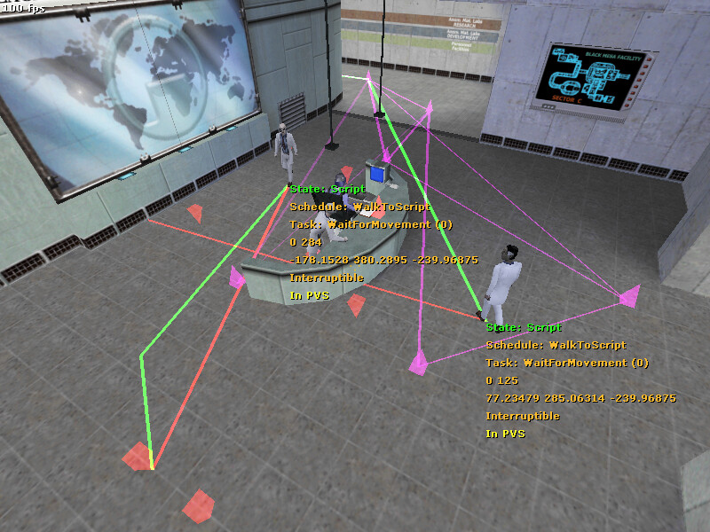

# HLInspect

Half-Life mod to facilitate Half-Life physics and NPC AI research.



## Features

- Easy and fast set up. No CMake or bespoke toolchains to mess with.
- Ability to hook custom `hl.dll` and `client.dll` **compiled yourself** in Debug mode, by reading debug information in PDB files and allow Visual Studio debugger to attach. This tends to break standard hooking based mods built for speedrunning purposes.
- Writing features in the higher level and simpler language of Go.
- Ability to write logs to debug output viewable with Microsoft's [DebugView](https://docs.microsoft.com/en-us/sysinternals/downloads/debugview). No installation of custom or bespoke viewing tools.

## Missing

- Only supports Windows
- Speedrunning features

## Usage

Currently, HLInspect doesn't come with an injector. You can use any general DLL injector to inject and start Half-Life, or even write your own. There are plenty of open source DLL injectors on Github, and do choose wisely. In the future, a custom injector may be included.

## Building

Currently, this is the easiest to build on Linux using cross compilation.

### Setup

Set up WSL in Windows or use a Linux system.

Install Go 1.17 or above.

Install `gcc-mingw-w64` to get `i686-w64-mingw32-gcc` or similar for cross compilation.

Install `protobuf-compiler` or similar to get `protoc`.

Run the following to get `protoc-gen-go`:

```bash
go install google.golang.org/protobuf/cmd/protoc-gen-go
```

Make sure `protoc-gen-go` can be found in `PATH`, which is needed by `protoc`. If not, set

```bash
export PATH="$PATH:"$(go env GOPATH)/bin
```

### Build

Suggested environmental variables in WSL:

```bash
export CC=i686-w64-mingw32-gcc
export CGO_ENABLED=1
export GOOS=windows
export GOARCH=386
```

Run the following to build:

```bash
cd hlinspect/modlib
go generate ./...
make
```

If this does not work, you may be able to get some hints from the Github workflow file.

## Development

See [ARCHITECTURE](ARCHITECTURE.md).
